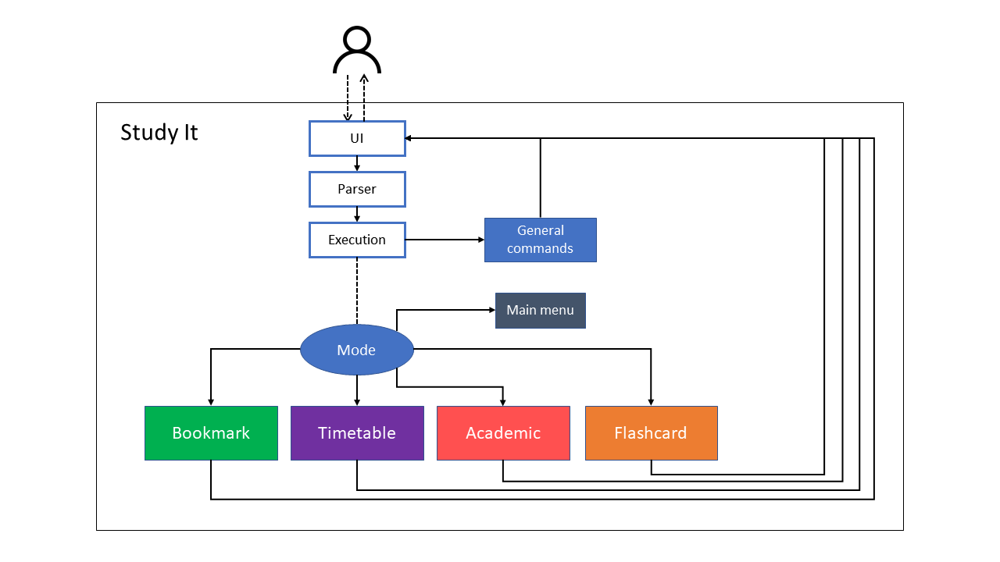
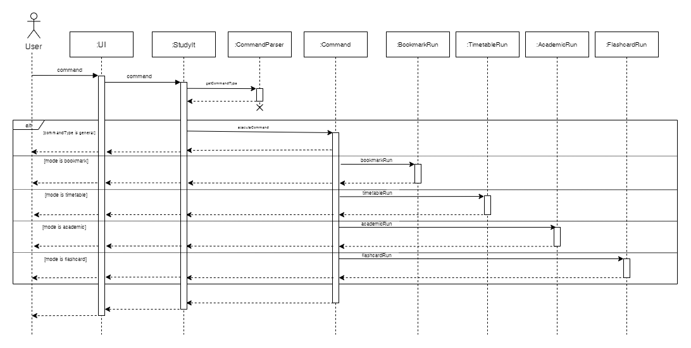
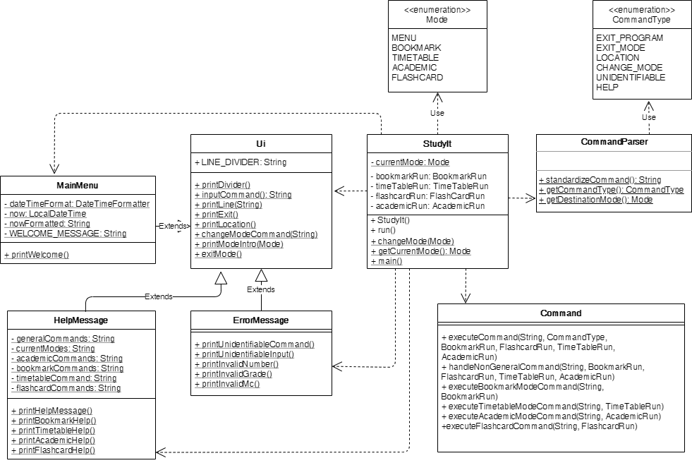
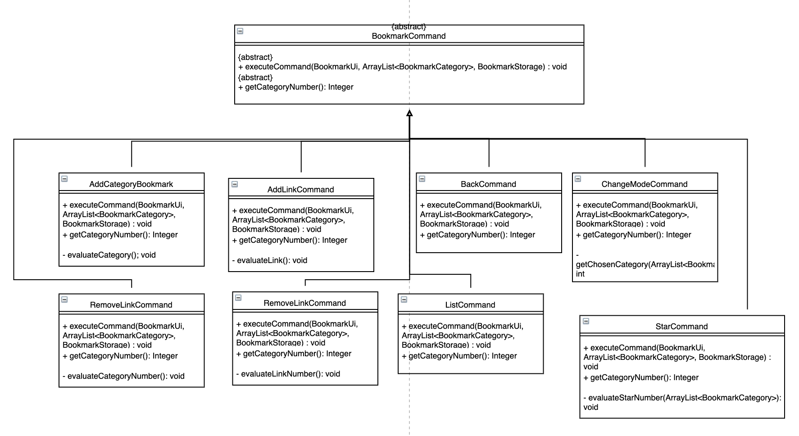

# Developer Guide

* Table of Contents
{:toc}

## Introduction
Welcome to Study It Developer Guide!

This document details the architecture of Study It. It aims to provide an overview of the high-level system 
architecture and design of the app. It will also break down the design of the app into smaller components and be 
explained in detail. This will allow the readers to understand the architecture and design flow of Study It and 
how it operates.

Study It is an interactive desktop app that helps NUS students manage their study related matters especially during 
this online study environment. It is optimized for use via a Command Line Interface (CLI). It can keep track of the 
student’s various study matters, present them in an organized and thoughtful manner to help them organize their 
study life. It will also provide various functionalities to help with their studies. 

The 4 main functionalities available now are bookmark, timetable, academic tracker and flashcard. 
Each of this will be discussed in detail under the “Design & Implementation” section later in the document.

## Setting up & getting started
**Requirements**
* Java 11.0.8
  * You may refer to this [website](https://www.oracle.com/java/technologies/javase/jdk11-archive-downloads.html) 
to download and install Java 11.0.8
  * The installation guide can be found in the following websites:
    * [Windows](https://docs.oracle.com/en/java/javase/11/install/installation-jdk-microsoft-windows-platforms.html#GUID-A7E27B90-A28D-4237-9383-A58B416071CA)
    * [Linux](https://docs.oracle.com/en/java/javase/11/install/installation-jdk-linux-platforms.html)
    * [Mac](https://docs.oracle.com/javase/10/install/installation-jdk-and-jre-macos.htm#JSJIG-GUID-2FE451B0-9572-4E38-A1A5-568B77B146DE)

**Running the software**
1. Download the tP.jar file from our [Github release](https://github.com/AY2021S1-CS2113T-T12-1/tp/releases) and 
place it in an empty folder
2. Open your computer’s command prompt
3. Change the directory of the command prompt to the folder containing tP.jar file
4. Type `java -jar tp.jar` into the command prompt and press Enter to execute it
5. If the application runs successfully, you’ll be greeted by a welcome message

**Setting up the project on your PC**
First, **fork** this repo, and **clone** the fork into your computer.

If you plan to use Intellij IDEA (highly recommended):
1. Configure the JDK: Configuring the JDK to ensure Intellij is configured to use JDK 11.
2. Import the project as a Gradle project.
3. Run the studyit.StudyIt and try a few commands.
4. Run the tests to ensure they all pass.

## Design & implementation
This section explains the architecture of our software and the design of each component.

### **Major components**
This section introduces the multiple components in Study It.

Study It contains 4 major functional components which are the 
bookmark, timetable, academic and flashcard. Each of these component
provide different functionalities, and they combine to form our software -- Study It.

Component | What it does
----------|----------------
Bookmark  | Stores internet links under different categories for easier access
Timetable | Tracks and display your weekly schedule
Academic  | Stores important contacts and keep track of your grades
Flashcard | Stores study questions and allow you to quiz yourself for easier memorization

The **main component** of Study It helps user access each of these components.
It processes the user input, provides general functionalities to traverse the software and other
helpful functionalities. This will be further explained under Study It's design later.

### Architecture
This section describes the overall architecture of Study It.

The *Architecture Diagram* given above explains the high-level design of the software.
Each component in the diagram will be briefly explained below.

The **`main`** in **`Study It`** is responsible for initializing all the other components
in the software.

The following is a brief overview of the components in Study It:
* **UI**: Handles the communication between the software and the user
* **Parser**: Processes the input from the user
* **Execution**: Perform the actions determined by the parser

The following components processes their respective actions (parsing and execution) and handles their own
storage component: 
* **Bookmark**
* **Timetable**
* **Academic**
* **Flashcard**

**General commands** are commands that takes priority in execution no matter which mode the software is currently
in.

**Modes of the program**

Study It has 5 **modes** that the user can navigate between:
* **Main menu**: Default mode when booting the software, there are no functionalities tied to this mode
* **Bookmark**
* **Timetable**
* **Academic**
* **Flashcard**

Each of these modes has their own unique commands. The user must switch to that mode to perform the
mode's functionalities.

User can switch between these modes at any point when using the software.

**How the architecture components interact with each other**

The following sequence diagram shows the interactions within the software when command is received from the user

As shown in the sequence diagram above, the user will interact with Study It via the User Interface (UI).
The commands received will then be parsed to identify the type of command. If the command is one of the 
general commands, it'll be processed and provide output. Otherwise, the command will be relayed
to different components to be processed based on the software's current mode. 

### **Main Component**

This section will give an overview of the main component of Study It.

The following class diagram shows the components related to the main Study It component and their respective
details.

The main class being run for the program is contained under `StudyIt` class. 
As there are multiple modes of our app (main menu/bookmark/timetable/academic/flashcard), 
the Mode enumeration and a private static currentMode of Mode type is introduced to monitor the current 
operating mode of StudyIt. This is to allow the program to respond to different commands under different modes.

Each command input by the user will be processed by CommandParser class to determine the command type. 
This information, along with the original command string will be passed into Command class and executed under 
executeCommand(). If it is one of the general commands, it will be processed by that class. 
If it isn’t, the Command class will detect the current mode of the program and run that command string under that 
specific mode, distributed under handleNonGeneralCommand() method. If it still doesn’t parse successfully, 
it will be considered an invalid command and an error message will be printed out.

The classes Ui, ErrorMessage, HelpMessage and MainMenu help handle the printing of various user interfaces of the 
program. ErrorMessage, HelpMessage and MainMenu are subclasses of Ui to make use of the methods in Ui.

StudyIt class will also initialize various instances of classes such as TimeTableRun, FlashCardRun, 
ArrayList<BookmarkCategory>, ArrayList<Grade>, ArrayList<Person> and pass it to Command class to perform 
each mode’s functionality.

### **Bookmark Component**

This bookmark section consists of how the bookmark feature is implemented. 
The bookmark feature is implemented similarly to the main architecture, however, 
in a smaller scale and a more bookmark-specific way. Figure 1 illustrates the general overview, 
the associations and the multiplicity of the bookmark classes.

**API:** `BookmarkRun`.

The bookmark component consists of six major classes: `BookmarkRun`, `BookmarkStorage`, `BookmarkUi`, 
`BookmarkCategory`, `BookmarkList` and `BookmarkParser`. 
As shown in figure 1, `BookmarkRun` is 
* The main class to be called when the bookmark mode is accessed.
* The main class to access other bookmark classes.

Given below, Figure 2, is the sequence diagram of how the classes interact with each 
other when bookmark mode is accessed from the main function.

The bookmark component has two modes: the main bookmark mode and the category mode. 
As shown in Figure 2, when `BookmarkRun` is called, 
`BookmarkParser` will be called and return a `BookmarkCommand`. 
Afterwards, `BookmarkRun` will then call `executeCommand` in `BookmarkCommand` which executes 
the intended actions. Then, it will call `getCategorymode` to get the current mode the user is in. 

**Bookmark Implementation**

A more detailed explanation of `BookmarkCommand`, `BookmarkCategory` and `BookmarkList` will be 
shown below. `BookmarkUi` and `BookmarkStorage` follow the same design implementations as the main 
architecture. The below figure shows the command classes available and they are called based on the 
`BookmarkParser` class as illustrated in Figure 2. 

Figure 4 shows a more detailed sequence diagram of how the `BookmarkCategory`, `BookmarkCommand` 
and `BookmarkList` interacts with each other for the scenario when the user input an `AddLinkCommand` 
in Bookmark mode.

### **Timetable Component**

This section will describe in detail how some features inside the timetable section have been 
implemented.

**API:** `TimeTableRun`.

The timetable component consists of 7 major classes as shown. The above figure illustrates the
 association and the multiplicity of the classes. 
 
 1. As shown in the figure, `TimetableRun` is the main class to be accessed 
 when the timetable function is called. 
 1. It associates with the `TimeTableStorage` class which is used to save data into a text file 
 1. `DateList` class that contains a number of `EventList`. 
 1. `EventList` contains a number of `Event`. 
 1. `Event` class is the abstract parent class for `Lesson` and `Activity`. 
 1. `Event` class also contains a number of `Duration` and it has a dependency on the `EvenType` enum.

The figure below is the sequence diagram of how the classes interact with each other when 
the main function make the run(command) API call.

### **Academic Component**

This section will describe in detail how some features inside the academic tracker section have been implemented.
The following diagram illustrates the general overview, the associations and the multiplicity of the academic classes.

API: `java.academic`

The above diagram looks at the overall structure of how the academic tracker is being implemented. 
This component is split into 7 different classes, 
their associations and multiplicity as explained in the above diagram. 
The functions of the academic tracker will be called through the `AcademicRun` class 
when the program is in academic mode, which will subsequently call 
the functions in `PersonBook` or `GradeBook`. 

The academic component:
* initialises two arraylists, `ArrayList<Grade>` and `ArrayList<People>` 
to store the relevant `Grade` and `People` objects.
* uses `AcademicCommandParser` to parse the user command.
* identifies `AcademicCommandType` to decide 
which of the commands under `PersonBook` or `GradeBook` is to be executed.
* calls `AcademicStorage` to store the current set of data into the local storage file.

**Academic Implementation**

This section explains the details on how certain features 
are implemented in the academic tracker.

**GradeBook Features**

The grade features are facilitated by `Gradebook`, which further make use of `Grade`. 
Each `Grade` will contain information such as the module's title, credits, grade, status of SU and status of star.
All grades are stored internally under `AcademicRun` as an array list `ArrayList<Grade>`.

It implements the following operations:
* `addGrade(String[], ArrayList<Grade>)`:Adds a `Grade` to the `ArrayList<Grade>`. 
* `printCap(ArrayList<Grade>)`:Calculate the current CAP based on the `ArrayList<Grade>`. 
* `printListOfGrades(ArrayList<Grade>)`:Print out all the `Grade` that are currently stored inside `ArrayList<Grade>`.
* `deleteGrade(Integer, ArrayList<Grade>)`:Delete a `Grade` from a specified index inside `ArrayList<Grade>`.
* `suGradeInGradeBook(Integer, ArrayList<Grade>)`:Su a `Grade` from a specified index inside `ArrayList<Grade>`.
* `starGrade(Integer, ArrayList<Grade>)`:Star a `Grade` from a specified index inside `ArrayList<Grade>`.
* `combineGradeDetails(Grade)`:Print out the details of a particular `Grade`.

The following sequence diagram demonstrates an example of how the Su Grade function works:

    

With reference to above, it can be observed that whenever a command modifies the array lists, 
`AcademicStorage` is called to update the local storage files.

**PersonBook Features**

The contact features are facilitated by `Personbook`, which further make use of `Person`. 
In terms of general structure, it is largely similar to that of `GradeBook`'s.

<!-- @@author hailqueenflo -->
### **Flashcard Component**

This section will describe in detail how the flashcard feature is implemented.

The above diagram looks at the overall structure of how the flashcard component is being implemented. 
This component is split into 4 different classes, their associations and multiplicity as explained in 
the above Figure 7. 
1. The main class `FlashcardRun` will be accessed when the flashcard mode is called in `StudyIt` Class. 
1. `FlashcardRun` class is associated with `FlashcardStorage` class that is used to store data in .txt file. 
1.`FlashcardDeck` class which contains any number of `Flashcards`.

**Flashcard Implementation**

With reference to Figure 8, when `FlashcardRun` is first initialised by `StudyIt`, it will construct 
the `FlashcardDeck` class. As an add card command is given by the user, `FlashcardRun` will take in the 
command and call `addCard()` method in `FlashcardDeck` which constructs a new Flashcard object and stores 
it inside the `FlashcardDeck` object.The `addCard()` function will then show the user the question and 
answer of the flashcard that have been created.
<!-- @@author -->
## Documentation, logging, testing, configuration, dev-ops
### Testing guide
Running tests:  
The main way that was used to run the test for Study It is:   
Using IntelliJ JUnit test runner.   
A. To run all tests, right-click on the src/test/java folder and choose 
Run Test in ‘tp.test’  
B. To run a subset of tests, you can right-click on a test package, 
test class or a test and choose Run ‘ABC’.  
Type of Tests  
This project has 5 types of tests. 4 tests to test each feature and 1 test to test the main integration of the whole application.

### Logging guide
We are using java.util.logging package for logging 
The StudyItLog class is used to manage the logging levels and logging destinations.
Log messages are output through the console and to a  .log file.
The output logging level can be controlled using .setlevel( )
When choosing a level for a log message, follow the following conventions:
1. SEVERE: A critical problem detected which may cause the termination of the application.
2. WARNING: Can continue, but with caution.
3. INFO: Information showing the noteworthy actions by the App.
4. FINE:  Details that are not usually noteworthy but may be useful in debugging.

### DevOps Guide 
Build automation  
This project uses Gradle for build automation management.
./gradlew build - check for checkstyle error and runs all tests
Code coverage
This project uses code coverage that is in IntelliJ IDE to check for the coverage of the code. 

## Appendix: Requirement 
### Product scope
**Target user profile:**
* studies in NUS
* has a need to manage a significant number of links
* has a need to manage their classes in a timetable
* has a need to manage their grades
* has a need to manage contact numbers of professors and teaching assistants.
* has a need to memorise content to study 
* prefer desktop apps over other types
* can type fast
* prefers typing to mouse interactions
* is reasonably comfortable using CLI apps  

**Value proposition:**
* manage links faster than a typical mouse/GUI driven app
* manage grades more easily than a typical mouse/GUI driven app
* manage contact numbers of professors and teaching assistants more effectively than a typical mouse/GUI driven app
* manage timetable in a more organised manner than a typical mouse/GUI driven app
* manage study content more efficiently than a typical mouse/GUI driven app 

#### User Stories

|Version| As a ... | I want to ... | So that I ...|
|--------|----------|---------------|------------------|
|v1.0|Student in Nus|organise my zoom links|don’t need to find the zoom link everytime lectures/tutorials start.|
|v1.0|student attending online classes|keep track of the timetable of my lessons whether  it is online or offline|do not miss any lessons.|
|v2.0|Student in Nus|organise all the useful signup links (internship/ hackathon/ talks) sent to our emails|can keep track of my time and dates of any relevant events.|
|v1.0|Student in Nus|keep track of my results and the number of SUs I have left,|can plan my semester properly|
|v1.0|student with packed timetables|see clashes in my timetable |can plan things without overlapping events.|
|v1.0|student taking a mod that requires me to memorize a lot of contents|organize the contents into flashcards|can revise them on the go.|
|v1.0|student who is worried about my results|calculate my CAP based on estimated grades|know i won’t get expelled :’)|
|v1.0|Student in Nus|keep track of my profs and ta’s contacts|know who to find when i have troubles.|
|v1.0|Student in Nus|bookmark all the important NUS websites|can access them more easily|

#### Non-Functional Requirements

* Should work on any [mainstream OS](#glossary) as long as it has Java 11 or above installed.
* A user with above average typing speed for regular English text 
(i.e. not code, not system admin commands) should be able to accomplish most of the 
tasks faster using commands than using the mouse.

## Glossary

* *Mainstream OS* - Windows, Unix, Linux, OS-X

## Instructions for manual testing

{Give instructions on how to do a manual product testing e.g., how to load sample data to be used for testing}
