# User Guide

* Table of Contents
{:toc}

## Introduction 

**Welcome to Study It User Guide!**

Study It is an interactive desktop app that helps manage your study related matters, 
optimized for use via a Command Line Interface (CLI). It can keep track of your various study matters, 
present them in an organized and thoughtful manner to help you organize your study life. 
It will also provide various functionalities to help with your studies. You will be able to make full 
use of the application if you can type fast.

This application currently has the following modes that you can access and use:
1. Menu 	    -   Central location of the app
1. Bookmark 	- 	Manage your online links at one convenient location
1. Timetable 	- 	Keep track of your weekly activities
1. Academic	    - 	Track your academic performance and store useful contact information
1. Flashcard	- 	Memorize your study content better with our built-in flashcard

## About
This app is targeted towards National University of Singapore (NUS) students studying in this current online 
environment. This user guide will be providing information about how to use the Study It app by 
showing you a step-by-step guide to access each functionality the app provides. 
By utilizing these features, you will be able to manage your study matters efficiently!

The following is a list of common notations and symbols you’ll encounter throughout the user guide:

1. INDEX_NUMBER
   
    Words of phrases in full capital indicates that they are inputs that you can decide on
   
1. `command`

    words or phrases highlighted indicate that they are actual commands you can use in the app
    
1. [website link](https://ay2021s1-cs2113t-t12-1.github.io/tp/UserGuide.html)
   
   Underlined words or phrases in blue colour are website links that you can press on to access the website

## Getting Started

Let’s get started with using Study It! This section will show you how you can run our app on your computer.

Firstly, please ensure that your computer fulfills the following requirement:
* Has Java 11.0.8
  * You may refer to this [website](https://www.oracle.com/java/technologies/javase/jdk11-archive-downloads.html) to download the Java 11.0.8 installer
  * The installation guide can be found in the following websites:
    * [Windows](https://docs.oracle.com/en/java/javase/11/install/installation-jdk-microsoft-windows-platforms.html#GUID-A7E27B90-A28D-4237-9383-A58B416071CA)
    , [Linux](https://docs.oracle.com/en/java/javase/11/install/installation-jdk-linux-platforms.html#GUID-737A84E4-2EFF-4D38-8E60-3E29D1B884B8) 
    , [MacOS](https://docs.oracle.com/javase/10/install/installation-jdk-and-jre-macos.htm)

Once you are done installing Java 11.0.8 onto your PC, you may follow these procedures to start using Study It:

1. Download the tP.jar file from our [Github release](https://github.com/AY2021S1-CS2113T-T12-1/tp/releases) and place it in an empty folder
1. Open your computer’s command prompt
   1. Windows: press Windows key + R, type “cmd” and press Enter
   1. MacOS: press Command - spacebar to launch Spotlight and type "Terminal," then double-click the search result
   1. Linux Ubuntu: press Ctrl + Alt + T
1. Change the directory of the command prompt to the folder containing tP.jar file
1. Type `java -jar tp.jar` into the command prompt and press Enter to execute it
1. If the application runs successfully, you’ll be greeted by the following welcome message:

    

Congratulations! You are now able to run Study It. To access its various functionalities,
you would need to type in the command at the Command Prompt and press Enter. Whenever you feel lost, 
refer to the following sections of this User Guide or call the `help` function in the app 
for guidance. We hope that you have fun using our app!

## General Commands

The following section details the general commands you can use in the app. 
These commands can be used anywhere in the app to help you navigate around the app.

This section contains the following commands:
* 1 : [Prints help message](#1-prints-help-message-help)
* 2 : [Changes the current mode](#2-changes-the-current-mode-cd-mode_name-or-mode_index)
* 3 : [Shows the current location](#3-shows-the-current-location-location)
* 4 : [Prints starred items](#4-prints-starred-items-highlight)
* 5 : [Exits the current mode or application](#5-exits-the-current-mode-or-application-exit)

>**Warning**
>The general commands doesn't work during `add class` or `add activity` sequence in timetable mode
>and `add` or `test` sequence in flashcard mode

### 1. Prints help message: `help`

The app will print out a summarised list of functions you can call at the current mode. 
This help message will vary depending on which mode you are at. 
Use this command to get guidance on what you can do with the app!

Instruction:
1. Type `help` and press Enter

Expected output:

Example of printing help message at menu:

    

Another example of printing help message at bookmark mode:

    

>**Useful information:**
>* The message varies in different modes to show you the commands at that mode. 
>Try it out!

### 2. Changes the current mode: `cd MODE_NAME or MODE_INDEX`

You can change to different modes of the app by using this command! 
The following are the modes currently available in the app and their corresponding index:
1. menu
1. bookmark
1. timetable
1. academic
1. flashcard

Instruction:
1. Type `cd` followed by the `MODE_NAME` or `MODE_INDEX`
1. Press Enter

Expected output:

Command: `cd 2`

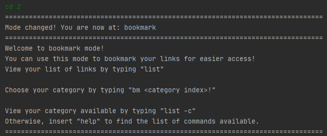

Command: `cd academic`

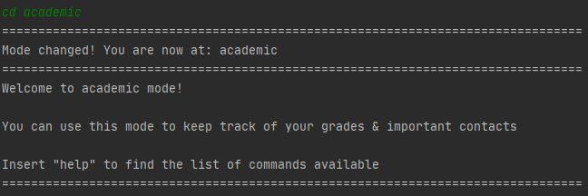

>**Warning**
>* An error message will appear when you type an invalid mode index or mode name
>
>
>
>* Ensure that your index is within range or you spelt the mode names correctly when using this command!

>**Useful information:**
>* You can use this command anywhere in the app to switch between modes quickly!
>* This command STILL works if you don't have space/have excess space 
>between `cd` and the `MODE_NAME/MODE_INDEX`

### 3. Shows the current location: `location`

Calling this command will show you which mode you are currently at.

Instruction:
1. Type `location` and press Enter

Expected output:

At bookmark mode:

At flashcard mode:

### 4. Prints starred items: `highlight`

This command will print out the starred items in Bookmark and Academic

Instruction:
1. Type `highlight` and press Enter

Expected output:

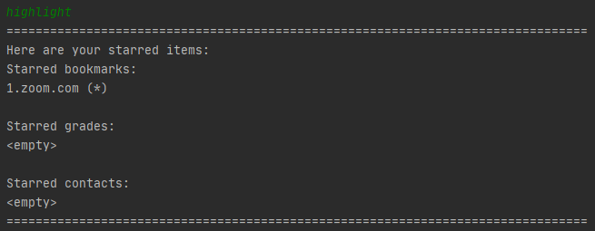

### 5. Exits the current mode or application: `exit`

This command behaves differently depending on which mode you are currently at.

If you are currently at the Main Menu, calling this command will exit the app as shown below:

Instruction:
1. Type `exit` and press Enter

Expected output:

If you are in any of the other modes (i.e. bookmark/timetable/academic/flashcard), 
calling this command will exit that mode and place you at the Main menu instead, as shown below:

Instruction:
1. Type exit and press enter when you are in any other modes besides Main menu

Expected output:

## Features 
<!-- @@author lingsihui -->
## 1. Bookmark

Now that more lessons are moving online, are you managing your links well? You might 
want to save your time finding your zoom links in your email inbox and save all your 
links in the bookmark feature to access them easily! The bookmark mode enables you to 
compile all your links in one destination and even categorise them into different groups. 
After entering the bookmark mode (refer to [General Command 2](#2-changes-the-current-mode-cd-mode_name-or-mode_index)), use the following commands to 
navigate around bookmark mode. 

This section contains 8 commands: 
* 1.1 : [Viewing all bookmark links / starred links / category](#11-viewing-all-the-bookmarks-links-listlist--s-list--c-list--a)
* 1.2 : [Going into each category](#12-going-into-each-category-bm-number)
* 1.3 : [Adding a category](#13-adding-category--cat-category_name-)
* 1.4 : [Deleting a category](#14-deleting-a-category--delete-category_number)
* 1.5 : [Going back to Bookmark main ](#15-going-back-to-bookmark-main-back)
* 1.6 : [Adding a link to your chosen category](#16-adding-a-link-to-your-chosen-category-add-link--add-link-t-title)
* 1.7 : [Deleting a link](#17-deleting-a-link-rm-link_number-)
* 1.8 : [Starring / Unstarring a link](#18-marking-unmarking-a-link-as-a-starred-link-star-link_number)

>**Warning**
>If you edit the data file wrongly, the bookmark feature will not be able to take in the correct category name, and links. 
>If you encounter any errors after handling the bookmark data file, refer to [FAQ](#faq)

### 1.1 Viewing all the bookmarks links: `list`,`list -s`, `list -c`, `list -a`

Are you trying to find your links by entering into each category to view your links?
You might want to have an easy way to view the overview of your links. 
You can now either view the entire list of links in the category you are in, 
the starred links, the list of categories available, 
or the entire list of links in every category using the following commands. 

Instructions:
1. If you want to view the list of links in the category you are in  = `list`  
2. If you want to view the entire list of starred links = `list -s`
3. If you want to view the entire list of category available = `list -c`
4. if you want to view the entire list of links in every category = `list -a`

Expected output:  

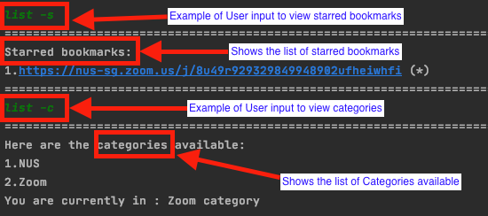

>**Useful Information:**
>* You can only use this command anywhere after entering the bookmark mode. (Refer to [General Command 2](#2-changes-the-current-mode-cd-mode_name-or-mode_index))
>* If your category does not have any links, it will indicate that the list is empty.
>* If you are in bookmark main, and you input `list`, it will show you the entire list of links in every category. (Same command as `list -a`)
>* To star / unstar a link refer to [1.8](#18-marking-unmarking-a-link-as-a-starred-link-star-link_number)
>* To add a category refer to [1.3](#13-adding-category--cat-category_name-), to delete a category refer to [1.4](#14-deleting-a-category--delete-category_number) 
>* You can also omit the space between `list` and `-a` / `-s` / `-c`
>* The user input is not case-sensitive.

>**Warning**
>* Follow the format `list`, `list -s`, `list -c`, `list -a` without adding additional inputs. If additional input is detected, the program will prompt you to input the correct format. 

### 1.2 Going into each category: `bm NUMBER`   

Managing so many links can be a hassle! However, categorising the links into different 
groups can make it even more efficient to find your links! After entering bookmark mode 
(refer to [General Command 2](#2-changes-the-current-mode-cd-mode_name-or-mode_index)), you can enter each category using the following commands. 
This command allows you to change the bookmark category within the bookmark mode. 
 
Instruction:
1. `bm NUMBER `

E.g. `bm 2`  
Expected output:   

>**Useful Information:**
>* You can only use this command anywhere after entering the bookmark mode. ( Refer to [General Command 2](#2-changes-the-current-mode-cd-mode_name-or-mode_index))
>* Zoom, Nus, Internship, Hackathon, Career Talks categories are included in the default.
>* If you are already in the chosen category, the program will inform you as shown in the figure below. 
>
>* You can also omit the space between `bm` and `NUMBER`
>* The user input is not case-sensitive.

If you encounter any errors, take note of the following warnings.

>**Warning:**
>* Ensure that the category NUMBER that you have chosen is valid. Error will be shown if the category NUMBER does not exist, or the NUMBER you have entered is not a number. To find out the valid category NUMBER, view the list of categories (Refer to [1.1](#11-viewing-all-the-bookmarks-links-listlist--s-list--c-list--a))

### 1.3 Adding category:  `cat CATEGORY_NAME `

If you cannot find the perfect category to place your bookmark, 
why not create your own category! In addition to the default categories 
that are added (Zoom, NUS, Internship, Hackathon, Career Talks), create your 
own category to add your bookmark links. Use the following commands to add a category 
and navigate it (Refer to [1.2](#12-going-into-each-category-bm-number)) the same way as the rest of your categories.

Instruction: 
1. `cat CATEGORY_NAME`   
  
e.g. `cat entertainment`, `cat stocks`

Expected output:   

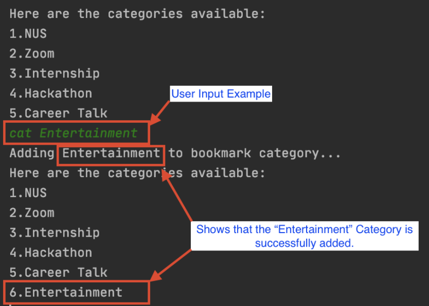

>**Useful Information:** 
>* You can only use this command anywhere after entering the bookmark mode.  (Refer to [General Command 2](#2-changes-the-current-mode-cd-mode_name-or-mode_index))
>* NUS, Zoom, Internship, Hackathon and Career Talk categories are included in the default.
>* You can also omit the space between `cat` and `CATEGORY_NAME`
>* The user input is not case-sensitive.

If you encounter any errors, take note of the following warnings. 

>**Warning:** 
>* Ensure that the category name is not empty. Error will be shown if the category name is empty. 
>* You can only add unique category name.

### 1.4 Deleting a category:  `delete CATEGORY_NUMBER`  

When you have a category, but you have no important links related to the category, take it out of your bookmark list! Organise and design your bookmark categories to your own personal needs by adding your own category (refer to [1.3](#13-adding-category--cat-category_name-)) and deleting unnecessary categories using these following commands.

Instruction:  

1. `delete CATEGORY_NUMBER`  

e.g. `delete 6`  

Expected output:  

>**Useful Information:**
>* You can only use this command in bookmark main.  (Refer to [1.5](#15-going-back-to-bookmark-main-back) to go back to the bookmark main)

Before deleting a category, take note of the following warnings. 

>**Warning:**
>* Ensure that the category NUMBER that you have chosen is valid. Error will be shown if the category NUMBER does not exist, or the NUMBER you have entered is not a number. To find out the valid category NUMBER, view the list of category available. (Refer to [1.1](#11-viewing-all-the-bookmarks-links-listlist--s-list--c-list--a))
>* CAUTION: Make sure to check all your links before deleting. Deleting a category will delete all the bookmarks in the category! 

### 1.5 Going back to bookmark main: `back` 

There are two modes in bookmark feature: the main bookmark mode (refer to [General Command 2](#2-changes-the-current-mode-cd-mode_name-or-mode_index)), 
and the category mode (Refer to [1.2](#12-going-into-each-category-bm-number)). To navigate freely from mode to mode, use the following command. 
This command goes back to the previous mode depending on which mode you are in. 
 
Instruction: 
1. `back` 

Expected output:   

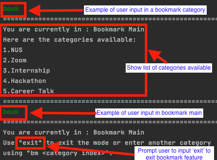

>**Useful Information:**
>* When you input back in any bookmark category, you are brought back to the bookmark main. 
>* When you input back in the bookmark main, you will be prompted to type “exit” to exit bookmark mode. 
>* The user input is not case-sensitive.

>**Warning:**
>* Follow the format `back` without adding additional inputs. 
>If additional input is detected, the program will prompt you to input the correct format. 

### 1.6 Adding a link to your chosen category: `add LINK` / `add LINK t->TITLE`

If you have a link to add to your bookmark category, follow these commands. 
Make sure you have chosen your category (Refer to [1.2](#12-going-into-each-category-bm-number)) 
and ensure that you do not add an invalid link or an empty link to your bookmark.
If you are afraid you will forget what the bookmark link is for, you can 
add a title to your bookmark link just by including a ` t-> TITLE` after you enter your link. 
In addition, if you forget what links you have already bookmarked, you can always 
add the same link, and the program will tell you whether you the link in your list.

Instruction: 
1. `add LINK` e.g. `add google.com`
2. `add LINK t->TITLE` e.g. `add https://nus-cs2113-ay2021s1.github.io/website/index.html t->Cs2113T`

Expected output:   

>**Useful Information:**
>* You can only use this command after choosing your category. (Refer to [1.2](#12-going-into-each-category-bm-number))
>* You can only bookmark unique links within your category. Refer to the following figure.  
>

If you encounter any errors, take note of the following warnings. 

>**Warning:** 
>* Ensure that you have chosen a category. You will be prompted to choose a category before you are allowed to add your links. (Refer to [1.2](#12-going-into-each-category-bm-number)) 
>* Ensure that the link added is valid. Error will be shown if the link you have given is empty or is not valid (contains " ", "\|" or does not contain “.”). 

### 1.7 Deleting a link: `rm LINK_NUMBER `

If you have a link that you no longer want to bookmark, or if you have a link that you accidentally bookmarked it, you can remove the bookmark easily just by following these few commands. Make sure that you have chosen your category (Refer to [1.2](#12-going-into-each-category-bm-number))  and ensure that you do not remove an empty, or an invalid link number.

Instruction: 
1. `rm LINK_NUMBER`

e.g. `rm 1`

Expected output:   

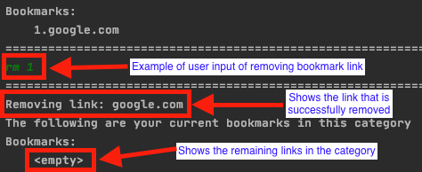

>**Useful Information:**
>* You can only use this command after choosing your category. (Refer to [1.2](#12-going-into-each-category-bm-number))

If you encounter any errors, take note of the following warnings. 

>**Warning:**
>* Ensure that you have chosen a category. You will be prompted to choose a category before you are allowed to remove your links. (Refer to [1.2](#12-going-into-each-category-bm-number)) 
>* Ensure that the link number that you want to remove is valid. Error will be shown if the link number you have given is empty or is not valid. Refer to [1.1](#11-viewing-all-the-bookmarks-links-listlist--s-list--c-list--a) to find out the correct link number. 

### 1.8 Marking/ Unmarking a link as a starred link: `star LINK_NUMBER`

You might have many links that you need to manage, however, some of the links might be more important than others. If you have such links, you can easily mark them up by following these few commands. Make sure that you have chosen your category (Refer to [1.2](#12-going-into-each-category-bm-number))  and ensure that you do not input an empty or invalid link number.
 
Instruction: 
1. `star LINK_NUMBER`  

e.g. `star 1`

Expected output:   

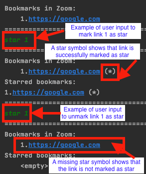{:width="30%" height="30%"}

>**Useful Information:** 
>* It is the same command for marking and unmarking any links. For example, if link 1 is not starred, star 1  will mark the link as starred. And if link 1 is starred, star 1 will unmark link 1. 
>* You can view your starred links in the highlight function in the main mode. (Refer to [General Command 4](#4-prints-starred-items-highlight))

If you encounter any errors, take note of the following warnings.  

>**Warning:**
>* Ensure that you have chosen a category. You will be prompted to choose a category before you are allowed to mark your links as starred. (Refer to [1.2](#12-going-into-each-category-bm-number)) 
>* Ensure that the link number that you want to mark as star is valid. Error will be shown if the link number you have given is empty or is not valid. Refer to [1.1](#11-viewing-all-the-bookmarks-links-listlist--s-list--c-list--a) to find out the correct link number. 

<!-- @@author slightlyharp -->
## 2. Timetable
Do you find it a hassle to keep track of all your activities and Zoom links for online classes?
Do you wish there was a simple, visual way to organise your day and foresee any clashes in your schedule?
The timetable mode intends to address these issues, helping you keep track of your work and helping you achieve
purposeful productivity.

>**Warning:**
>* Do not try to edit the data file for the timetable if you are unsure. Doing so may result in the application not being able to
>retrieved the saved data, hence deem the data file corrupted and request to format the data file before you can use the timetable 
>feature again.

This section contains 10 commands to navigate the Timetable mode:
* [2.1. Entering timetable mode](#21-entering-timetable-mode-cd-3--cd-timetable)
* [2.2. Adding classes](#22-adding-classes-add-class)
* [2.3. Adding activities](#23-adding-activities-add-activity)
* [2.4. Showing links](#24-showing-links-show-link)
* [2.5. Showing schedule](#25-showing-schedule-show-schedule)
* [2.6. Showing activities list](#26-showing-activities-list-list-activity)
* [2.7. Showing classes list](#27-showing-class-list-list-class)
* [2.8. Deleting an activity](#28-deleting-an-activity-delete-activity-index)
* [2.9. Deleting a class](#29-deleting-a-class-delete-class-index)
* [2.10 Removing all past events](#210-removing-all-past-events-clean-up)

### 2.1 Entering timetable mode: `cd 3` / `cd timetable`

If you find it difficult to make plans due to uncertainties in your schedule, this timetable mode presents your upcoming
events at a glance to know what to expect and stay on track. This command brings you to enter the timetable mode.

Instruction:

1. `cd 3` / `cd timetable`

Expected output:

{:height="80%" width="80%"}

>**Useful information:**
>* You can use this command from any mode to access the timetable mode easily and quickly!

### 2.2 Adding classes: `add class`

If you find it hard to keep track of all your Zoom links with an increasing number of online classes, you can now
arrange your classes in a systematic manner with this feature. Make sure you are currently in the timetable mode
([refer to 2.1](#21-entering-timetable-mode-cd-3--cd-timetable)).

Instruction:

1. `add class`
2. Answer the questions as prompted

Expected output:

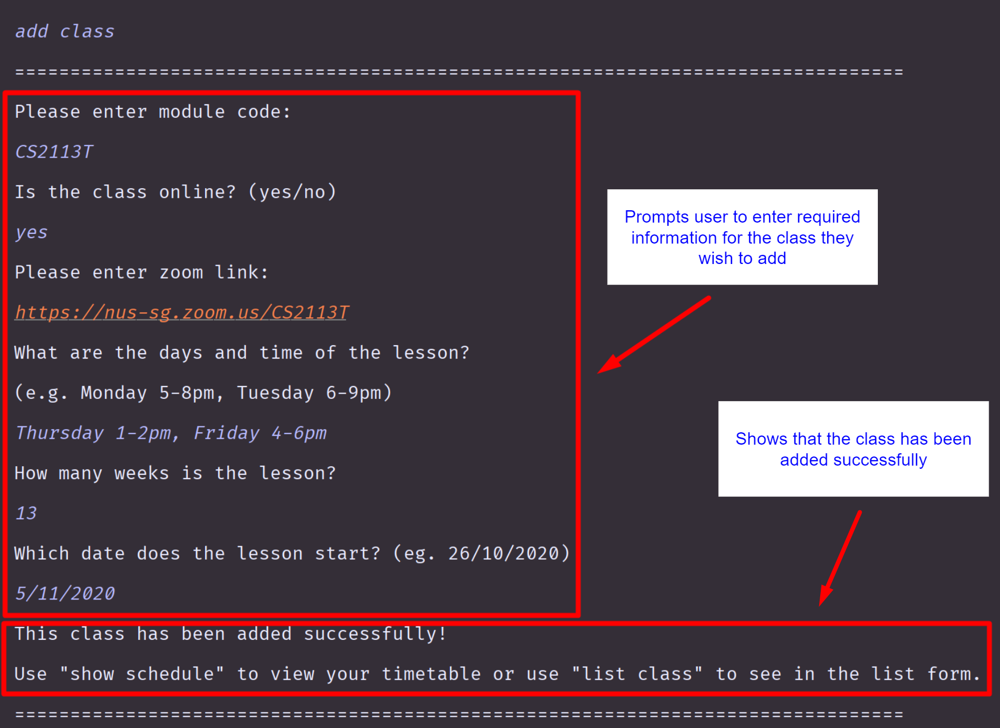{:height="80%" width="80%"}

>**Useful Information:**
>* The module code will accept any input between 1-7 characters.
>* You can enter the time in both 12hr and 24hr format. Only entering am/pm at the back of the duration will be assumed 
>as both starting and ending time are in the same period.

If you encounter any errors, take note of the following warning.

>**Warning:**
>* Ensure that you follow the format for answering the questions.
>Error will be shown if the questions are not answered in a suitable format.
>* Adding events that clash with the existing schedule will result in error message. You will need to check through 
>the schedule and events list and delete the unwanted event accordingly before you can add the new event.
>* Number of recurring classes are capped at 52 weeks (1 year) to ensure effective processing time. Add your class again one year
>later if your class recurs for more than a year.

### 2.3 Adding activities: `add activity`

It can be hard to view your upcoming events at a glance.
Similar to the previous feature, this command allows you to add activities outside of classes to your schedule.

Instruction:

1. `add activity`
2. Answer the questions as prompted

Expected output:

{:height="80%" width="80%"}

>**Useful Information:** 
>* Currently this feature does not support adding activity past 12am. If you wish to schedule an activity overnight, 
>add the activity in 2 separate sessions.

### 2.4 Showing links: `show link`

If you find it hard to keep track of all your conference links for your classes or activities, this command will present
all links relevant to you for the next 2 hours.

Instruction:
1. `show link`

Expected output:

{:height="80%" width="80%"}

### 2.5 Showing schedule: `show schedule`

If you wish to view your schedule for the next seven days with all the activities, use this command.

Instruction:
1. `show schedule`

Expected output:

{:height="80%" width="80%"}

>**Warning:**
>* If the name of event is more than 10 character only the first 10 character will be shown.

### 2.6 Showing Activities list: `list activity`

If you wish to see all activities you have input into the system, 
this command will present all the activities you have added with their starting date and time, if the activity is 
online, and the venue/link of the activity.

Instruction:
1. `list activity`

Expected output:

{:height="80%" width="80%"}

### 2.7 Showing Class list: `list class`

If you think searching through the timetable is too troublesome,
use this command to see all the classes you have added and other details of the classes, similar to the previous feature.

Instruction:
1. `list class`

Expected output:

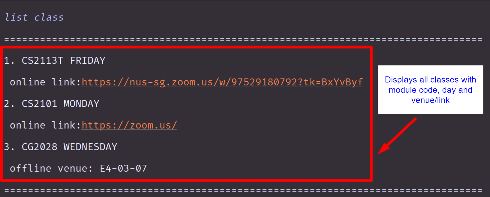{:height="80%" width="80%"}

### 2.8 Deleting an activity: `delete activity INDEX`

If you have accidentally added a wrong activity, or an activity you have added has been cancelled,
use this command to delete an activity with corresponding index according to the activities list ([refer to 2.6](#26-showing-activities-list-list-activity)).

Instruction:
1. `delete activity INDEX`

Example of usage: 

`delete activity 1` will delete the first activity in the list.

Expected output:

{:height="80%" width="80%"}

### 2.9 Deleting a class: `delete class INDEX`

Similar to feature 2.8,
use this command to delete a class with corresponding index according to the classes list ([refer to 2.7](#27-showing-class-list-list-class)).

Instruction:
1. `delete class INDEX`

Example of usage: 

`delete class 2` will delete the second class in the list.

Expected output:

{:height="80%" width="80%"}

>**Warning:**
>* Deleting a class will delete all the lessons of that module on schedule. Use this command with caution. 

### 2.10 Removing all past events: `clean up`

Having too many events added to the application, and the data file is taking up too much space?
Use this command to remove all the activities that was over more than 7 days ago and all the classes with their last lesson 
concluded more than 7 days ago.

Instruction:
1. `clean up`

Expected output:

{:height="80%" width="80%"}

>**Warning:**
>* Deletion will be done automatically. All the events that are deleted will not be able to be retrieved. 
>Only use this if you are sure you do not need your past events.

<!-- @@author -->

## 3. Academic
Have you ever had to dig through tons of emails to look for the contact of a particular TA 
or sweat over your calculator when trying to estimate your CAPS this semester? 
Academic tracker provides a convenient experience where you can store 
all the information you need in one place! To access the academic tracker, 
follow the instructions below.

This section contains 12 commands to navigate the academic mode:
* [3.1 Entering Academic Mode](#31-entering-academic-mode-cd-4--cd-academic)
* [3.2 Adding a contact](#32-adding-a-contact-add-contact-ccontact_details-mmobile_number--eemail)
* [3.3 Listing all contacts](#33-listing-all-contacts-list-contact)
* [3.4 Starring a contact](#34-starring-a-contact-star-contact-index)
* [3.5 Deleting a contact](#35-deleting-a-contact-delete-contact-index)
* [3.6 Adding a grade](#36-adding-a-grade-add-grade-nmodule_name--mmc--ggrade)
* [3.7 Listing all grades](#37-listing-all-grades-list-grade)
* [3.8 Checking current cap](#38-checking-current-cap-check-cap)
* [3.9 Starring a grade](#39-starring-a-grade-star-grade-index)
* [3.10 SU-ing a grade](#310-su-ing-a-grade-su-grade-index)
* [3.11 Deleting a grade](#311-deleting-a-grade-delete-grade-index)
* [3.12 Listing all the starred items in academic](#312-listing-all-the-starred-items-in-academic-list-star)

### 3.1 Entering Academic Mode: `cd 4` / `cd academic`

This command allows you to enter academic tracker mode from the main menu or from the other modes.
After entering this mode, you can then access all the features that the academic tracker offers!

Instruction: 

1. `cd 4` / `academic`

Expected output:

>**Useful information:**
>* You can use this command from any mode to access the academic mode easily and quickly!

### 3.2 Adding a contact: `add contact c/CONTACT_DETAILS m/MOBILE_NUMBER  e/EMAIL`

In academic mode, you can add a contact to the current list of contacts, following the instructions below. 

Instruction: 
1. `add contact c/CONTACT_DETAILS  m/MOBILE_NUMBER  e/EMAIL`

Example of usage: 

`add contact c/Prof Lim  m/81234567  e/E7654321@u.nus.edu` 
will add a contact with the name Prof Lim, mobile number 81234567, and email E7654321@u.nus.edu.

Expected output:  

>**Warning:**
>* Numbers should be a positive integer with 8 or fewer digits , and email should be in the form abc@xyz.

### 3.3 Listing all contacts: `list contact`

You can view all the contacts that have been added previously 
and stored on your computer by following these sets of instructions

Instruction: 
1. `list contact`

Expected output:

### 3.4 Starring a contact: `star contact INDEX`

Sometimes you may wish to highlight an important contact, and that's where
starring a contact come into use. Follow the instructions below to mark an 
important contact with a star.

Instruction: 
1. `star contact INDEX`

Example of usage: 

`star contact 1` will mark the first contact in the list with a star.

Expected output:

### 3.5 Deleting a contact: `delete contact INDEX`

Do you no longer require the contact of the TA of last sem's module? 
Make use of the delete contact function to clean up your contacts by following the
instructions below.

Instruction: 
1. `delete contact INDEX`

Example of usage: 

`delete contact 1` will delete the first contact in the list.

Expected output:

### 3.6 Adding a grade: `add grade n/MODULE_NAME  m/MC  g/GRADE`

In academic mode, you can add a grade to the current list of grades, following the instructions below. 

Instruction: 
1. `add grade n/MODULE_NAME  m/MC  g/GRADE`

Example of usage: 

`add grade n/CS2101  m/4  g/A-` 
will add a grade with the title CS2101 that has 4 credits and scored an A-.

Expected output:  

>**Warning:**
>* Note that module credits need to be a positive integer, and grade entered must be a valid grade.
>* This program doesn't cap how many MCs a module can have.
>* This application is not synced to a module database, so any valid input will be accepted as a module name.

### 3.7 Listing all grades: `list grade`

You can view all the grades that have been added previously 
and stored on your computer by following these sets of instructions

Instruction: 
1. `list grade`

Expected output:

### 3.8 Checking current cap: `check cap`

To calculate your current CAP based on the grades you have entered previously, 
follow the instructions below

Instruction: 
1. `check cap`

Expected output:

### 3.9 Starring a grade: `star grade INDEX`

The star grade function can be used to highlight a particular grade. 
Follow the instructions below to mark an 
important grade with a star.

Instruction: 
1. `star grade INDEX`

Example of usage: 

`star grade 1` will mark the first grade in the list with a star.

Expected output:

### 3.10 SU-ing a grade: `su grade INDEX`

SU-ed a module and want to exclude it from your CAP calculation? The SU grade
function allows you to do just that through these simple steps.

Instruction: 
1. `su grade INDEX`

Example of usage: 

`su grade 1` will su the first grade in the list.

Expected output:

>**Warning:**
>* The process of SU-ing a mod is not retractable. Should you accidentally SU a mod unintentionally, 
>consider deleting the mod and adding a new one.

### 3.11 Deleting a grade: `delete grade INDEX`

The delete grade function can be used to delete a grade from the currently stored
 list of grades by following the instructions below.

Instruction: 
1. `delete grade INDEX`

Example of usage: 

`delete grade 1` will delete the first grade in the list.

Expected output:

### 3.12 Listing all the starred items in academic: `list star`

The list star function works like the highlight function, but only displaying
the starred items inside the academic section. 

Instruction: 
1. `list star`

Expected output:

## 4. Flashcard

Do you wish you had a quick way to refer to the content that will be tested in your upcoming tests?
Or a more efficient way to verify your knowledge?
Perhaps it is also difficult to scour your handwritten notes to find a particular piece of information.
The flashcard mode aims to tackle these aspects that may hinder your learning process.

This section contains 6 commands to navigate the Flashcard mode:
* [4.1. Entering flashcard mode](#41-entering-flashcard-mode-cd-5--cd-flashcard)
* [4.2. Adding flashcards](#42-adding-flashcards-add)
* [4.3. Listing flashcards](#43-listing-flashcards-list)
* [4.4. Deleting flashcards](#44-deleting-flashcards-delete)
* [4.5. Testing content](#45-testing-contenttest)
* [4.6. Finding relevant flashcards](#46-finding-relevant-flashcards-find)

### 4.1 Entering flashcard mode: `cd 5` / `cd flashcard`

If you find it hard to be fully proficient in your study topics, this flashcard mode is a medium for you to actively
learn and memorise. This enables you to learn effectively through repetition, helping you to remember information better
in the long-term. This command allows you to enter the flashcard mode.

Instruction:
1. `cd 5` / `cd flashcard`

Expected output:

{:height="80%" width="80%"}

>**Useful information:**
>* You can use this command from any mode to access the flashcard mode easily and quickly!

### 4.2 Adding flashcards: `add`

To assist you in your studies, there needs to be a knowledge base of content to be revised.
You can do this by adding new flashcards to the flashcard deck with this command, after entering flashcard mode
([refer to 4.1](#41-entering-flashcard-mode-cd-5--cd-flashcard)).

Instruction:
1. `add`
2. Enter the question and answer as prompted
 
Example of usage:

`4+4` followed by `8` will create a flashcard with question 4+4 and answer 8.

Expected output:

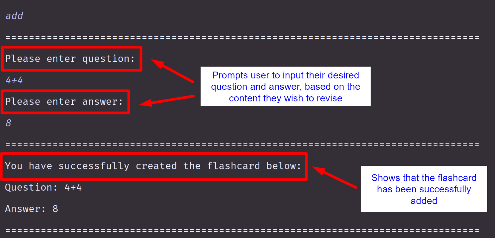{:height="65%" width="65%"}

If you encounter any errors, take note of the following warning.

>**Warning:**
>* “back” and "show answer" cannot be added as an answer for the flashcard.
>This is because “back” and "show answer" are used as commands to exit and reveal the answer in the test mode
>respectively.
>If the flashcard answer you wish to use is similar to “back” or "show answer", rephrase and use another term.
>
>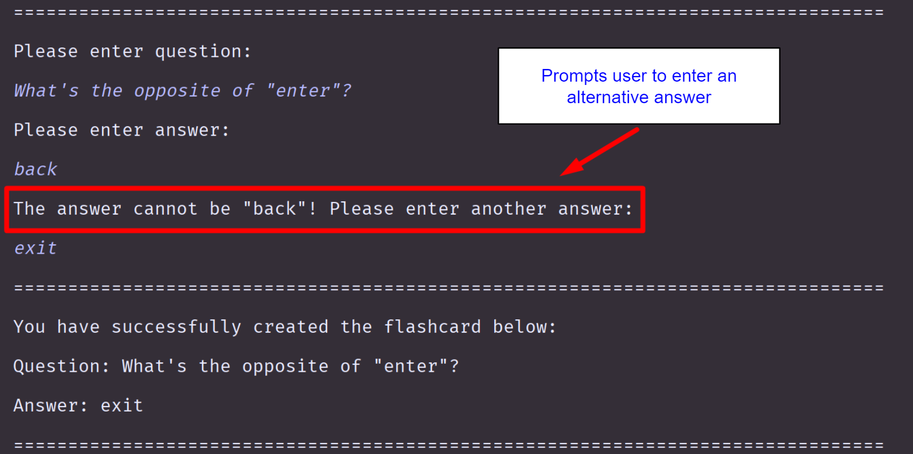{:height="60%" width="60%"}

### 4.3 Listing flashcards: `list`

If you wish to review the content that is currently in the flashcard deck, this command can display all flashcards that
have been added.

Instruction:
1. `list`

Expected output:

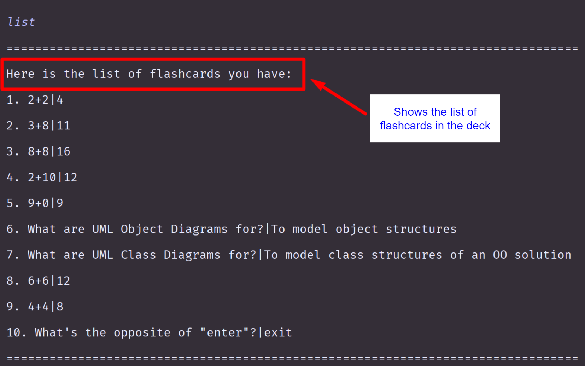{:height="80%" width="80%"}

### 4.4 Deleting flashcards: `delete`

When you have a flashcard that is no longer relevant to you or contains wrong information, you can delete the flashcard
from the flashcard deck.

Instruction:
1. `delete`
2. Enter the card index of the flashcard to be deleted as prompted

Example of usage:

`3` will delete the 3rd flashcard in the list.

Expected output:

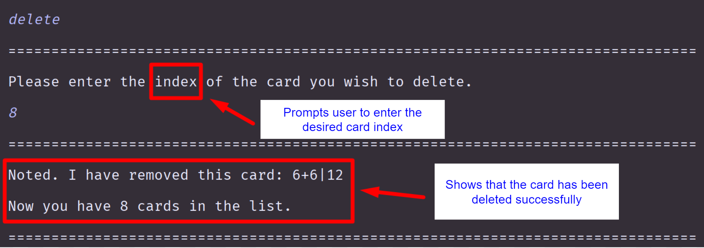{:height="80%" width="80%"}

>**Useful information:**
>* You can use the `list` command to check the card index.

### 4.5 Testing content:`test`

Grading your own work is one of the best ways to revise as it helps you effectively retain information.
After adding the flashcards, you may wish to revise the content by testing yourself. 

If you are unable to answer a question and wish to refer to the answer, use `show answer`.
When you are done revising, use `back` to exit the test mode, and return to the flashcard main.

Instruction:
1. `test`
2. Answer the questions as prompted
3. `show answer` / `back`

Expected output:

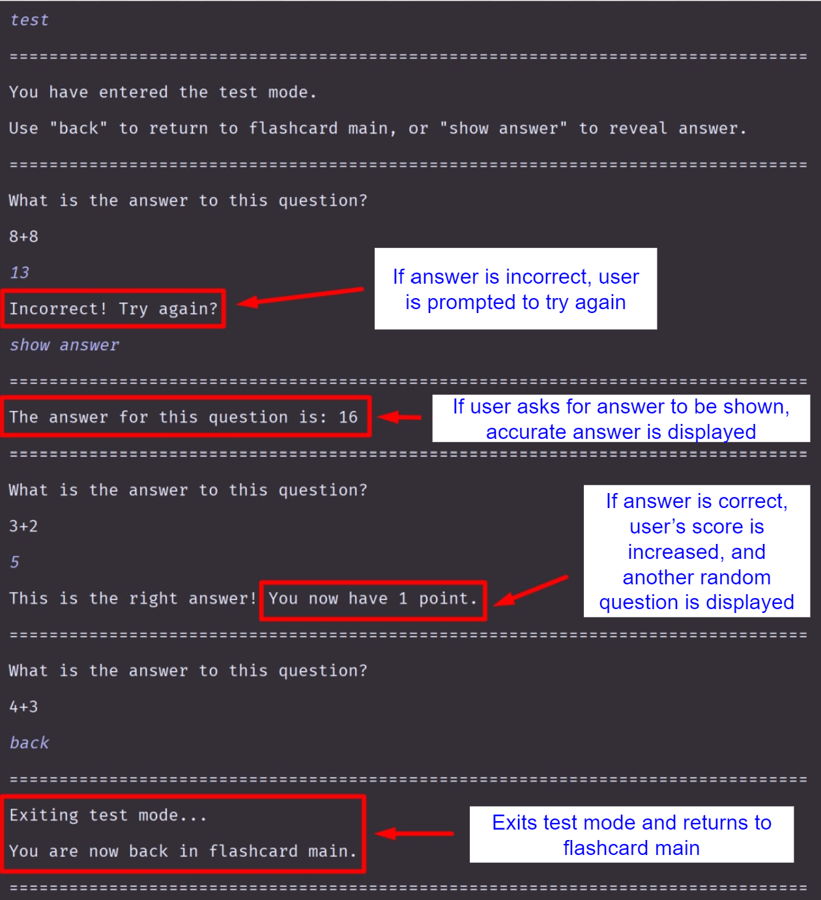{:height="60%" width="60%"}

>**Useful information:**
>* User input in the test mode is not case sensitive. If the answer is correct but the case is different from
>the stored answer, the answer will be accepted as the right answer.

### 4.6 Finding relevant flashcards: `find`

If you wish to look through the flashcards containing only a particular search term, use this command.

Instruction:
1. `find`
2. Enter the desired search term as prompted

Expected output:

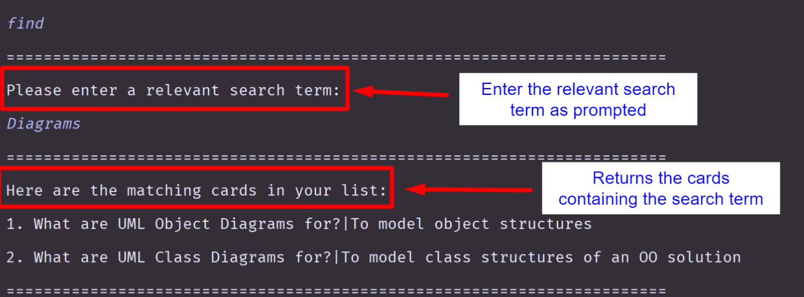{:height="80%" width="80%"}

## FAQ

**Q**: How do I transfer my data to another computer? 

**A**: All of Study It's data are stored under the `ROOT_FOLDER/data` folder.
To transfer these data to another computer, please back up the `data` folder 
and copy it over to the directory in the new computer accordingly after installing the app.

**Q**: Why is my application not starting up properly?

**A**: Please refer to the ["Getting Started"](#getting-started) section and ensure that 
the correct version of java is installed on your computer. If you face any further difficulties, 
feel free to refer to the About Us page and contact any of the developers.

**Q**: Why is XXX feature not supported?

**A**: As this app is still under development, there are many features we would like to add in the future.
Do feedback to us what features you would like to see in Study It!

**Q**: What to do if bookmark data does not load properly after changing the bookmark.txt file?

**A**: This is for users who editted the bookmark.txt file in the data folder. If you encounter trouble after editing the data file, 
you can do one of the following steps: 
* revert the changes in the data file.
* delete the bookmark data file.
* ensure the bookmark data file are stored in the correct format. This is the following format: 
    * CategoryName = links \| links \| \|STAR\|links \| links t->title 
    * Category name and the links are separated with a " = " and each link is separated with a " \| ". (Take note of the space before and after the symbols)
    * A starred link has \|STAR\| in front of the link. A link with a title has " t->" infront of the title. (Take note of the space in front of t->)

## Command Summary

The following table is a compiled list of all available commands in our application that you can easily refer to! 

The commands listed under the sections besides “General” can only be called when you are in that specific mode, 
which you can access using the cd command!

Table: Command Cheatsheet for Study It

    

    

